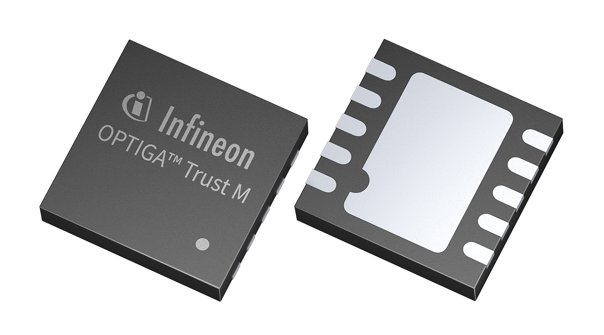

Security Chip
=================

Description
-----------------

This repository contains a target-agnostic Software Framework for the `OPTIGA™ Trust M <https://www.infineon.com/optiga-trust>`_ security chip. It is a base for other application notes.

Summary
-----------------

The OPTIGA™ Trust M is a security solution based on a secure microntroller. Each device is shipped with a unique elliptic-curve keypair and a corresponding X.509 certificate. OPTIGA™ Trust M enables easy integration into existing PKI infrastructure.

Key Features and Benefits
-----------------

* High-end security controller
* Common Criteria Certified EAL6+ (high) hardware
* Turnkey solution
* Up to 10kB user memory
* PG-USON-10-2 package (3 x 3 mm)
* Temperature range (−40°C to +105°C)
* I2C interface with Shielded Connection (encrypted communication)
* Cryptographic support: **ECC NIST P256/P384**, **SHA-256**, **TRNG**, **DRNG**, **RSA® 1024/2048**
* OPTIGA™ Trust M Software Framework on Github
* Crypto ToolBox commands with **ECC NIST P256/P384**, **SHA-256** (sign, verify, key generation, ECDH(E), key
derivation), **RSA® 1024/2048** (sign, verify, key generation, encrypt and decrypt)
* Device Security Monitor
* Hibernate for zero power consumption
* Lifetime for Industrial Automation and Infrastructure is 20 years and 15 years for other Application Profiles
