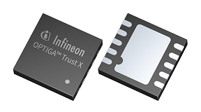

Security Chip
=================

Description
-----------------

This repository contains a target-agnostic Software Framework for the [OPTIGA™ Trust X](https://www.infineon.com/optiga-trust-x) security chip. It is a basis for other application notes.

Summary
-----------------

The [OPTIGA™ Trust X](https://github.com/Infineon/Assets/raw/master/PDFs/OPTIGA_Trust_X_Datasheet_v2.6.pdf) is a security solution based on a secure microntroller. Each device is shipped with a unique elliptic-curve keypair and a corresponding X.509 certificate. OPTIGA™ Trust X enables easy integration into existing PKI infrastructure.

Key Features and Benefits
-----------------

* High-end security controller
* Turnkey solution
* One-way authentication using ECDSA
* Mutual authentication using DTLS client (IETF standard RFC 6347)
* Secure communication using DTLS
* Compliant with the USB Type-C™ Authentication standard
* I2C interface
* Up to 10 KB user memory
* Cryptographic support: ECC256, AES128, SHA-256, TRNG, DRNG
* PG-USON-10-2 package (3 x 3 mm)
* Standard & extended temperature ranges
* Full system integration support
* Common Criteria Certified EAL6+ (high) hardware
* Cryptographic Tool Box based on ECC NIST P256, P384 and SHA256 (sign, verify, key generation, ECDH, session key derivation)   
* Lifetime for Industrial Automation and Infrastructure is 20 years and 15 years for other Application Profiles
